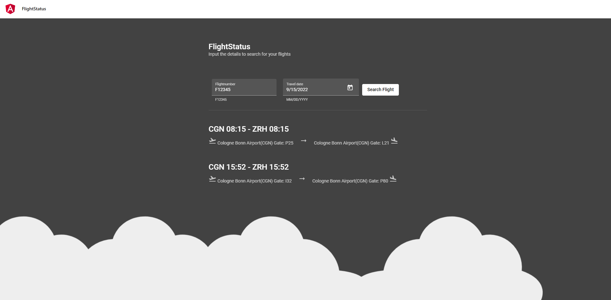
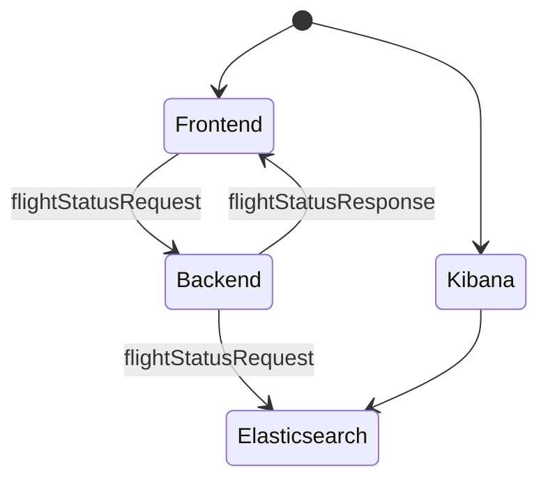

# Flightstatus Example



The Flightstatus example is an application containing a lightweight java spring-boot microservice, elasticsearch and kibana to demonstrate a possible integration.


## Quickstart
###  Run using docker-compose

The docker image for the backend is built and pushed to the github container registry during CI. The application exposes an endpoint on port 8090 which is used to retrieve the input text via a HTTP Post. Therefore we will expose this port when running the image.


Start the microservice, Elasticsearch and Kibana using Docker Compose:
```bash 
docker-compose up -d
```

Your Elasticsearch node will startup now, and after a couple of seconds, you can reach it at `http://localhost:9200/`, Kibana will be running at `http://localhost:5601` and the backend at `http://localhost:8090/`.


To shut down Elasticsearch and Kibana run:
```bash 
docker-compose down
```

In case you also would like to remove the docker volume while shutting down run:
```bash 
docker-compose down -v
```

### Search for flight status
The microsoervice provides and endpoint that requires a json containing the flightnumber and traveldate(`yyyy-MM-dd format`) as string.
```bash
curl --location --request POST 'localhost:8090' \
--header 'Content-Type: application/json' \
--data-raw '{ "flightNumber": "F12345", "travelDate": "2022-08-17" }'
```


The endpoint returns an array of flights that matches the input.
```JSON
{
  "flight": [
    {
      "departureTime": "2022-08-17 18:17:00",
      "arrivalTime": "2022-08-17 21:15:22",
      "derpartureAirport": {
        "fullName": "Cologne Bonn Airport",
        "shortName": "CGN"
      },
      "arrivalAirport": {
        "fullName": "Cologne Bonn Airport",
        "shortName": "CGN"
      },
      "departureGate": "B05",
      "arrivalGate": "A12",
      "flightNumber": "F12345"
    }
  ]
}
```
 For more information regarding available endpoints and schemas please refer to the openapi specification and the swagger-ui that is automatically generated and available during runtime on `http://localhost:8090/swagger-ui/index.html`

## Further information
### General
For example purposes the application will automatically create and return a random list of flights for the provided traveldate if the flightnumber matches `F12345`. All flights that are created this way are stored as document in elasticsearch indexed under `flights`.

All requested flights independent of the flightnumber are stored as document in elasticsearch and indexed under `requests`


### Usage with Eureka Server
The Application can register itself with an Eureka Server instance for service discovery. To do so, set the environment variable `EUREKA_URL`.
### Tools / Modules used

 * Java 17
 * Spring Boot
 * Elasticsearch Java client


## Build manually

### Prerequisites
 * JDK 17
 * Maven
 * Docker

### Build Jar
For manually building the project run
```bash 
cd flight-status-backend && mvn clean package
```

### Build Docker container
For manually building the project run
```bash 
cd flight-status-backend && docker build -t flight-status-backend .
```
